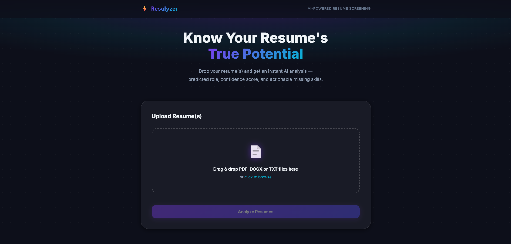
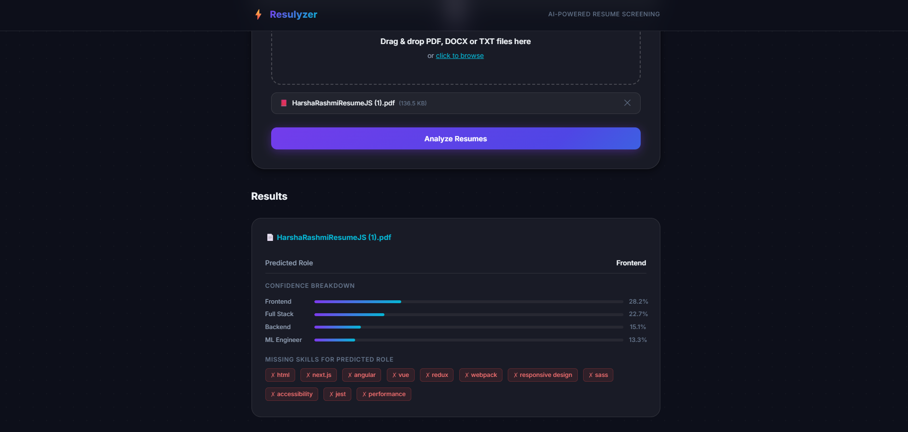

# 🚀 Resulyzer — AI Resume Analyzer

Resulyzer is an AI-powered resume screening system that predicts the most likely job role for a resume, highlights matched and missing skills for the role, and generates a selection score (0–100%). It's designed to be easy to run locally using Docker, and includes a web UI and an optional Java CLI.

---

## ✨ Highlights

- **⚡ Fast, local ML service** using TF-IDF + Logistic Regression
- **💻 Drop-in web UI** for bulk or single resume analysis (PDF, DOCX, TXT)
- **🎯 Role-based skill matching** (shows matched / missing skills)
- **📊 Selection scoring** to rank candidates
- **⚙️ Optional Java CLI** for automation or CI integration

---

## 📸 Screenshots

<div align="center">
  
  <br>
  <em>Drag and Drop Resume Upload Interface</em>
  <br><br>
  
  <br>
  <em>Detailed AI Analysis, Role Prediction, and Skill Matching</em>
</div>

---

## 🚀 Quick Start (Recommended)

1. **Clone or open the repository** and change to the project folder:
   ```bash
   cd Resulyzer
   ```

2. **Build Docker images** (first run downloads dependencies — 2–5 minutes):
   ```bash
   docker-compose build
   ```
   > **Note**: If you see an error like `The system cannot find the file specified` regarding `dockerDesktopLinuxEngine`, ensure **Docker Desktop** is open and running in the background.

3. **Start MySQL and the Python ML web service**:
   ```bash
   docker-compose up mysql python-ml
   ```

4. **Access the Web UI**:
   Open your browser at [http://localhost:5000](http://localhost:5000) — drag & drop or browse to upload resumes, then click "Analyze Resumes".

5. **Stop services**:
   ```bash
   docker-compose down
   ```

> **First-run note**: MySQL needs ~30–40 seconds to initialise. The roles dropdown will auto-populate once the DB seed completes.

---

## 🛠️ Alternative: Run without Docker (Local Python Setup)

If you prefer to run it without Docker, you can set up a Python virtual environment:

1. **Create and activate a Python virtual environment:**
   ```powershell
   python -m venv venv
   .\venv\Scripts\activate
   ```
2. **Install the dependencies:**
   ```powershell
   pip install -r ml/requirements.txt
   ```
3. **Run the Flask application:**
   ```powershell
   python ml/analyze_resume.py
   ```
*(Note: The UI will run at `http://localhost:5000`. However, the app relies on a MySQL database, so some features might fail if a local database is not configured. Using Docker Compose is highly recommended!)*

---

## 💻 Usage

### Web UI
- Visit `http://localhost:5000`
- Upload one or many resumes (`.pdf`, `.docx`, `.txt`)
- Click **Analyze Resumes** — results show predicted role, confidence, matched/missing skills, and a selection score

### Java CLI (Optional)
Use the Java CLI to analyze a resume from the command line. This invokes the ML API from the containerized Java runtime:

```bash
docker-compose run --rm java-cli java -jar resulyzer.jar /path/to/resume.pdf "Backend"
```
*Supported roles (default seed): Backend, Frontend, Data Analyst, DevOps, Full Stack, ML Engineer*

### API (for automation)
The Python service exposes endpoints to submit and analyze resumes programmatically. See `ml/analyze_resume.py` for routes and payload details.

---

## 🏗️ Architecture & Tech Stack

- **ML**: scikit-learn (TF-IDF vectorizer + Logistic Regression)
- **API**: Python 3.11 + Flask + Gunicorn
- **CLI**: Java 17 (JDBC)
- **Database**: MySQL 8.0 (seeded with `role_skills.sql`)
- **Deployment**: Docker + Docker Compose

---

## 🧑‍💻 Development & Extending

- **Add a new role**: Update `data/role_skills.sql` (role + weighted skills), then seed MySQL and retrain the model if needed.
- **Re-train model locally**: See `ml/train_model.py` and ensure `data/resumes.csv` is present.
- **Debug ML/API**: Run the `ml` service locally in a Python 3.11 venv.

---

## 🐛 Troubleshooting

- **Roles dropdown stuck at loading**: wait ~40s for MySQL to finish initialising and seeding.
- **`docker-compose build` fails for Java**: ensure the host has internet access so the MySQL JDBC dependency can be downloaded.
- **Docker Desktop Engine Error**: If you see `error during connect: Head "http://%2F%2F.%2Fpipe%2FdockerDesktopLinuxEngine/_ping"`, it means Docker Desktop is not running. Please start Docker Desktop and wait for the engine to start.
- **Port conflicts**:
  - If `5000` is in use, change `"5000:5000"` to `"5001:5000"` in `docker-compose.yml`.
  - If `3307` is in use, change `"3307:3306"` to `"3308:3306"`.
- **`model.pkl` missing**: confirm the `data` volume is mounted correctly; `docker-compose` should mount it by default.

---

## 📚 FAQ

**Q: Can I run the ML service without Docker?**
A: Yes — set up a Python 3.11 venv, install `ml/requirements.txt`, then run `python ml/analyze_resume.py` (or start via Gunicorn as in `ml/entrypoint.sh`).

**Q: How do I add training data?**
A: Add labeled resumes to `data/resumes.csv` (text + role), then run `ml/train_model.py` to regenerate `model.pkl`.

---

## 🤝 Contributing
Contributions, issues and feature requests are welcome. Please open an issue first so we can discuss scope and approach.

---

## 📄 License
This project is provided as-is. Add a LICENSE file to clarify terms if you plan to distribute or open-source it.

---
For deep-dive documentation and code walkthroughs, see `resulyzer_learning_docs.md`.

<br>
<div align="center">
  Made with love ❤️ by Harsha Rashmi <br>
  <a href="mailto:sinhaharsha2805@gmail.com">sinhaharsha2805@gmail.com</a>
</div>
